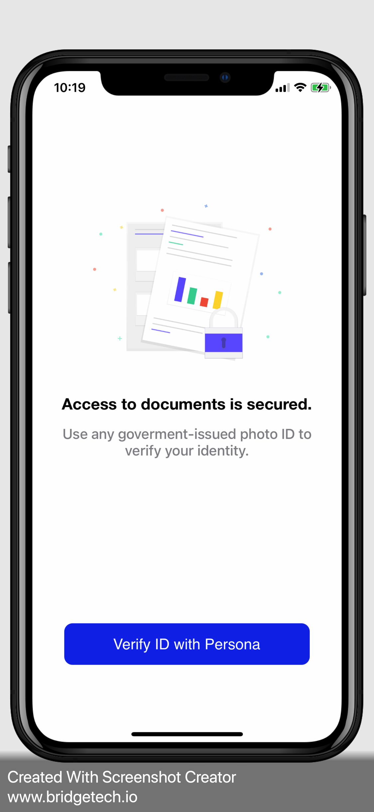

# identity-verification-app

iOS Application written in swift that demonstrate the use of Persona inquiry SDK.

## Screenshots
Start Persona flow |  Persona Screen 1      |  Persona Screen 2        |  Verification successful       |  App flow starts|
:---------------------------:|:-------------------------:|:---------------------------:|:-------------------------:|:-------------------------:
  |  |  |  |  

## Dependencies
- [Persona](https://withpersona.com) - Persona Comprehensive Identity Platform
- [Undraw](https://undraw.co) - Open source illustrations
